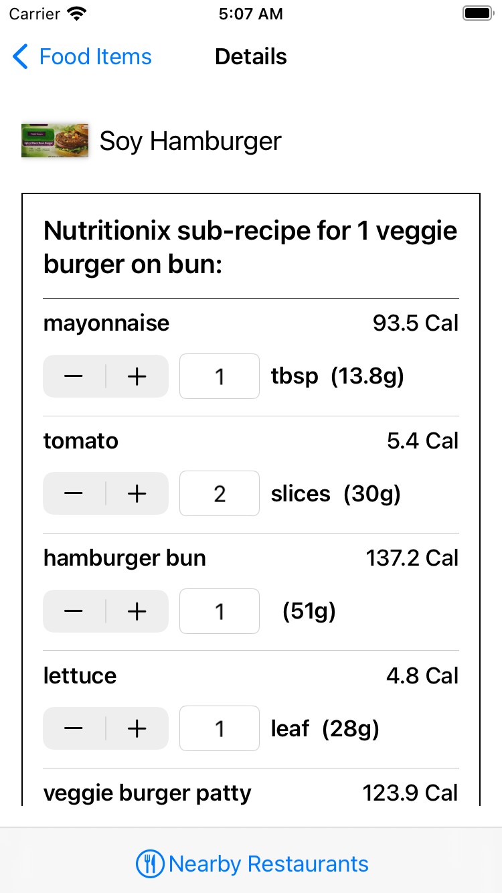

# CercacorDemo

This project successfully integrates the Nutritionix API into an iOS app, providing users with food search functionality, detailed nutrition information, and a user-friendly interface designed for iOS devices running iOS 15 and above. Below are the key features implemented:

## Features Implemented

 1. **Food Search**
    
    -   Users can search for foods by name using the Nutritionix API.
    -   Display search results with food images, names, and calorie information.
    
-   **Food Detail View**
    
    -   Upon selecting a food item from the search results:
	    - Display food details
        - Show detailed nutrition information. (Calories, Nutrient amount etc. ) 
        - Display ingredients of the selected food.
       
-   **Dynamic Nutrition Calculation**
    
    -   Allow users to change the quantity of serving size.
    -   Automatically recalculate nutrition information based on the adjusted quantities.
  
-   **UI Design for iOS**
    
    -   Designed screens including:
        -   Food search results screen.
        -   Detailed view of selected food item including ingredients and nutrition.

## Implementation Details

### Technologies Used

-   **Development Environment:** Xcode 14.2
-   **Target iOS Version:** iOS 15+
-   **Programming Language:** Swift, SwiftUI
-   **Design Pattern:** MVVM
- 

## User Interface Screenshots

### Light Mode
&nbsp;&nbsp;&nbsp;&nbsp;&nbsp;&nbsp;
  &nbsp;&nbsp;&nbsp;&nbsp;&nbsp;&nbsp;
     
  &nbsp;&nbsp;&nbsp;&nbsp;&nbsp;&nbsp;
  &nbsp;&nbsp;&nbsp;&nbsp;&nbsp;&nbsp;

### Dark Mode
&nbsp;&nbsp;&nbsp;&nbsp;&nbsp;&nbsp;
  &nbsp;&nbsp;&nbsp;&nbsp;&nbsp;&nbsp;
     
  &nbsp;&nbsp;&nbsp;&nbsp;&nbsp;&nbsp;
  

## Additional Notes

-   **Unit Test Cases:** Implemented to ensure code reliability and correctness.
    
-   **Debounce for API Calls:** Implemented `.debounce` to enhance robustness by preventing rapid API calls during user input.
    
-   **Dependency Management:** Utilized Swift Package Manager (SPM) for integrating SDWebImage for efficient image caching and loading.
    
-   **Async/Await:** Utilized for asynchronous programming, enhancing readability and maintainability.
    
-   **Dependency Injection:** Implemented protocols to ensure a flexible and maintainable codebase, facilitating easier testing and future updates.

- **Direct Commit to `main` branch:** Code was committed directly to the main branch due to being the sole developer, eliminating the need for a Git workflow initially. 

## Future Enhancements

-   **NetworkReachabilityManager:** Implement to handle network connection status and provide appropriate feedback to users.

- **Offline Use:** Implement offline support to allow users to access previously viewed food information and perform searches without an active internet connection. 
    
-   **Nearby Restaurants:** Integrate functionality to display nearby restaurants offering selected foods in either a list or map view.
    
-   **Accessibility Improvements:** Enhance accessibility features to improve usability for all users.
    
-   **Error Management:** Implement better error handling and messaging to enhance user experience and app robustness.
    
-   **Performance Optimization:** Continuously optimize code and UI/UX for smoother and more responsive interactions.
